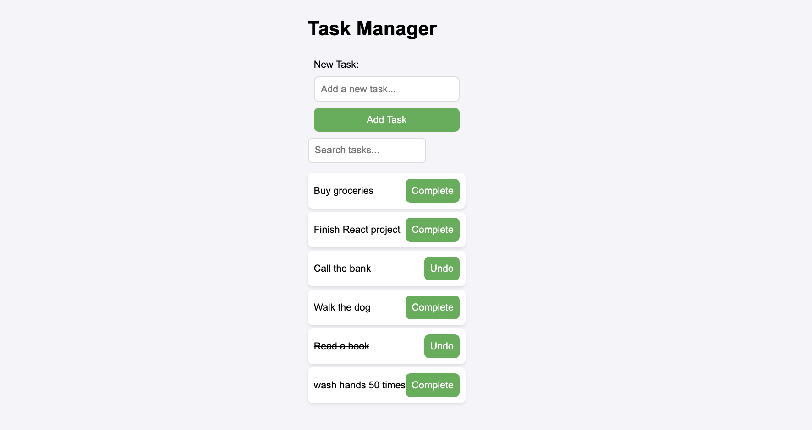

# Task Manager (React Hooks Lab)

A simple task manager app built using React. It lets you add new tasks, mark them as complete, and filter them using a search bar. 
---
## Table of Contents

- [Demo](#demo)
- [Setup](#️setup)
- [Testing](#testing)
- [Features](#features)

---

## Demo

---

## Setup

1. Fork and clone the repo.
2. Install dependencies: `npm install`
3. Run backend server: `npm run server`
4. Run the frontend: `npm run dev` 

## Testing

- To run the tests: `npm run test`

## Features
- Add new tasks with a form
- Use useId() to link label and input
- Tasks render instantly (optimistic UI)
- Toggle task completion with a button
- Filter tasks by name using a search bar
- Global task state with useContext()
- Persistent search input with useRef()